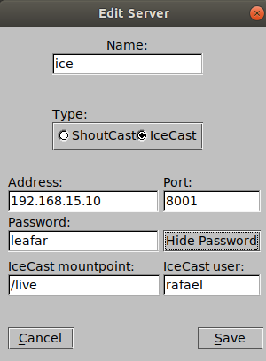

.. Rádio liquidsoap documentation master file, created by
   sphinx-quickstart on Mon Aug  6 19:56:33 2018.
   You can adapt this file completely to your liking, but it should at least
   contain the root `toctree` directive.

Documentação Rádio c/ Liquidsoap
============================================
Documentação relativa a Rádio implementada com Liquidsoap.
Nesta documentação estão presentes as configurações necessárias 
para reinstalar e manipular o projeto em questão.

.. toctree::
   :maxdepth: 2
   :caption: Contents:

Instalação
======================================
*Se já houver uma instalação antiga da rádio, execute o seguinte comando antes de prosseguir:*
``sudo rm -r /home/streaming/.opam``

1. ``git clone https://gitlab.com/rafaelbaiolim1/liquidsoap.git -b install setup``
2. ``cd setup && sudo ./install.sh``
3. ``sudo mkdir /var/run/liquidsoap && sudo chown streaming:streaming /var/run/liquidsoap``
4. ``sudo su streaming``
5. ``source ~/.profile``
6. ``echo "create database `stream_cast`" | mysql -u <username> -p``
7. ``cd /home/streaming/web/assets/ && mysql -u <username> -p stream_cast < locutores.sql"`` 

Verificação
======================================
Antes de prosseguir com os teste, verifique se a pasta ``/home/streaming/.opam/system`` 
foi criada, uma vez que o ``liquidsoap`` é iniciado a partir do ``bin`` desta pasta.


Testes
======================================

Geração e Teste (Porta 8000)
----------------------------
O IP da máquina é associado automaticamente em ``src.config.generator.php``.  

1. ``cd /home/streaming``
2. ``php web/app/utils/src.config.generator.php``
3. ``sudo chmod 777 -R /home/streaming/configs``
4. ``sudo killall icecast2``
5. ``sudo killall liquidsoap``
6. ``sudo icecast2 -c configs/8000.xml -b``
7. ``sh scripts/ligar_autodj 8000 1``
8. ``sudo chmod 777 -R /home/streaming/configs``

Live
-----------
Por padrão o script gera a *live* na porta seguinte ``(porta + 1)``.
``Não é possível colocar a live e a rádio na mesma porta``.
As configurações para conexão do *DJ* na rádio da porta ``8000`` 
pode ser configurada na ferramenta ``Butt`` como na figura abaixo.



Os dados desta autenticação estão na tabela de ``'locutores' do banco MYSQL``, importada no passo de instação.
A tabela usada para testes deve conter os seguintes registros para que o ``brodcast`` da ``live`` na porta ``8000`` funcione: 

.. csv-table:: Registro de teste da tabela locutores
   :file: locutores.csv
   :header-rows: 1 

*Note que é necessário que as flags de schedule, bem como os horários de streaming estejam setados para a autenticação ocorrer corretamente*

Explicações Detalhadas
======================================

Iniciando a aplicação
----------------------------
A partir do root é possivel inicializar o programa usando o script `ligar_autodj`,
execute .:

``sudo su - streaming scripts/ligar_autodj $1 $2``

``$1 (parâmetro obrigatório) : porta icecast2``

``$2 (parâmetro opcional, executa a saída do liquidsoap em primeiro plano) : TRUE``
*Os logs do liquidsoap estão habilitados para geração em arquivo e por padrão começam desabilitados. 
Para ativar os logs veja a secção de configuração do XML do Liquid.* 


Manipulação e Execução do Projeto 
----------------------------
A elaboração deste projeto foi adaptada a partir da sua versão inicial, substituindo 
a ferramenta ICES por Liquidsoap. Para rodar o autodj é necessário que os seguintes 
processos sejam executados.:

1. Banco MySQL com os dados importados para autenticação das lives.

2. Icecast2 com sua respectiva config. (Playlist e Live) 

3. Script do Liquidsoap apontando para as config. do Icecast.

4. Servidor PHP rodando na pasta `web/app/` do projeto. 

5. JSON da playlist com o formato que será apresentado. Assim como o caminho dos arquivos de 
audio setados corretamente.

Executando Liquidsoap
#####################

Com a ferramenta devidamente instalada, veja a secção :ref:`Instalação do Liquidsoap com Encoders`
se necessário, execute o script ``web/app.dist.liq`` utilizando como parâmetro a porta em que o `icecast2` 
está executando Ex.:

``$ liquidsoap app.dist.liq -- $porta``

``--`` É necessário para informar ao liquid que as linhas seguintes referem-se a parâmetros 
do script. A partir deste ponto o liquidsoap já estará rodando e transmitindo a rádio através 
das configurações do Icecast.

Arquivo XML de configuração do Liquidsoap
#####################
Para manter a compatibilidade com a versão inicial deste projeto foi implementado a bind dos atributos 
presentes no arquivo de configuração XML dos clientes do autodj. O arquivo a seguir foi utilizado 
para realizar os testes no servidor.

.. literalinclude:: conf.example.xml 
  :language: JSON

Nem todos os atributos deste arquivo são utilizados pelo script do Liquidsoap, mas podem ser mantidos 
como linguagem de marcação. Embora existam tags encadeadas como por exemplo : "<Audio>..</Audio>", as tags mais externas 
não são consideradas pelo script, dessa forma apenas as tags com valor atribuido são processadas, como por exemplo "<Fadein>0</Fadein>". 
Segue os atributos com suas descrições.

.. csv-table:: Tabela de atributos obrigatórios Conf.xml
   :file: conf-strct.csv
   :widths: 30, 70
   :header-rows: 1

O encoder AAC pode assumir os dois valores informados acima em `audio-obj-type`, 
mpeg4_aac_lc é usado por padrão, a explicação desses valores podem ser encontradas em:

http://wiki.hydrogenaud.io/index.php?title=Fraunhofer_FDK_AAC 

Arquivo XML de configuração exemplo Icecast2
#############################################

.. literalinclude:: icecast2.example.xml 
  :language: JSON

Arquivo JSON da playlist
#####################
Para que os scripts funcionem corretamente o arquivo JSON de configuração
de playlist deve obrigatóriamente conter os seguintes atributos.:

.. literalinclude:: playlist-strct.json
  :language: JSON

.. csv-table:: Tabela de atributos obrigatórios Playlist.json
   :file: structure_playlist.csv
   :widths: 30, 70
   :header-rows: 1

Scripts para Manipulação da Playlist
#####################

Os scripts desenvolvidos que manipulam as playlists do autodj assim como 
a playlist estão em sua maioria localizados na pasta ``app/service`` e são utilizados 
em sua maioria como ``$php + _nome-do-script``.

.. csv-table:: Tabela de Scripts que permitem chamadas externas
   :file: structure.csv
   :widths: 25 25 25 25
   :header-rows: 1

Instalação do Liquidsoap com Encoders
----------------------------
A aplicação assim como as dependências do liquidsoap são gerenciadas 
através do Package Manager Opam. Não instale o OPAM nem suas dependências
como `root`, utilize o usuário que será usado para execução do S.O .

1. Instalação do opam:
``$ sudo apt-get update && sudo apt-get install opam``

Em seguida:
``$ opam init && eval `opam config env```

2. Instalação do Liquidsoap
 
Verifique as dependências necessárioas através do plugin depext:  
``$ opam install depext && opam depext taglib mad lame vorbis cry ssl samplerate magic opus liquidsoap``

Para instalar: ``$ opam install taglib mad lame vorbis cry ssl samplerate magic opus liquidsoap``

3. Instalação dos pacotes de codificação para os principais formatos diferentes de MP3
``$ opam depext fdkaac && opam install fdkaac``

Dependências do Servidor
----------------------------

As deste projeto podem ser instaladas com o seguinte comando:  

``$ sudo icecast2 git python python-dev apache2 php php-xml php-simplexml php-mysql 
mysql-server opam``

Script de Instalação
----------------------------

O script de instalação foi desenvolvido para automatizar e auxiliar na instalação
das ferramentas desta documentação e pode ser encontrado em .:

https://gitlab.com/rafaelbaiolim1/liquidsoap/tree/install


Observações Pertinentes
=========================

De preferência a usar caminhos absolutos para referenciar o caminho dos arquivos,
tanto no arquivo JSON quanto nos parâmetros de script.

Soluções Conhecidas
===================

Playlist reinicia do começo de cada música
-------------------------------------------
Arquivo XML do icecast2 não esta com memória alocada suficiente,
tente aumentar o <burst-size>.

Autenticação no Mountpoint da live
-------------------------------------------
É provavel que o servidor PHP não esteja rodando, basta iniciar 
ele pra que o popup de autenticação pare de aparecer.

Problema de Leitura dos Arquivos XML
------------------------------------
*solução>* ``sudo chmod 777 -R /home/streaming/configs/``

Falta de memória no servidor para instalção do OPAM
-----------------------------------------------------
*solução>* Crie um arquivo de swap temporário com os seguintes comandos:

1. ``sudo dd if=/dev/zero of=/swapfile1 bs=1024 count=524288``
2. ``sudo mkswap /swapfile1``
3. ``sudo chown root:root /swapfile1``
4. ``sudo chmod 0600 /swapfile1``
5. ``sudo swapon /swapfile1``

Lembrando que se isso ocorrer ao realizar o login será necessário atualizar
as variavéis de ambiente para o opam ser reconhecido, use o comando a seguir:

``eval `opam config env` && source ~/.profile``

Grupo de usuário sem permissão no Liquidsoap
--------------------------------------------
*solução>* Verifique no ``xml de configuração do icecast2`` se existe a seguinte chave: 

.. literalinclude:: solucoes.permissaoliquid.xml
  :language: JSON

Habilitar Conexão Remota MYSQL
--------------------------------
*solução>*

1. ``$mysql -u root -p``
2. ``GRANT ALL PRIVILEGES ON *.* TO 'root'@'%' IDENTIFIED BY 'SENHA_DO_ROOT' WITH GRANT OPTION; FLUSH PRIVILEGES;``
3. Edite o arquivo: ``/etc/mysql/mysql.conf.d/mysqld.cnf``> #bind-address = 127.0.0.1
4. ``sudo service mysql restart``
